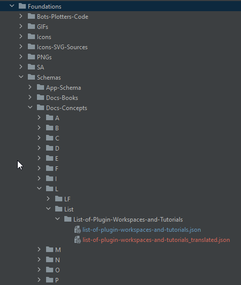
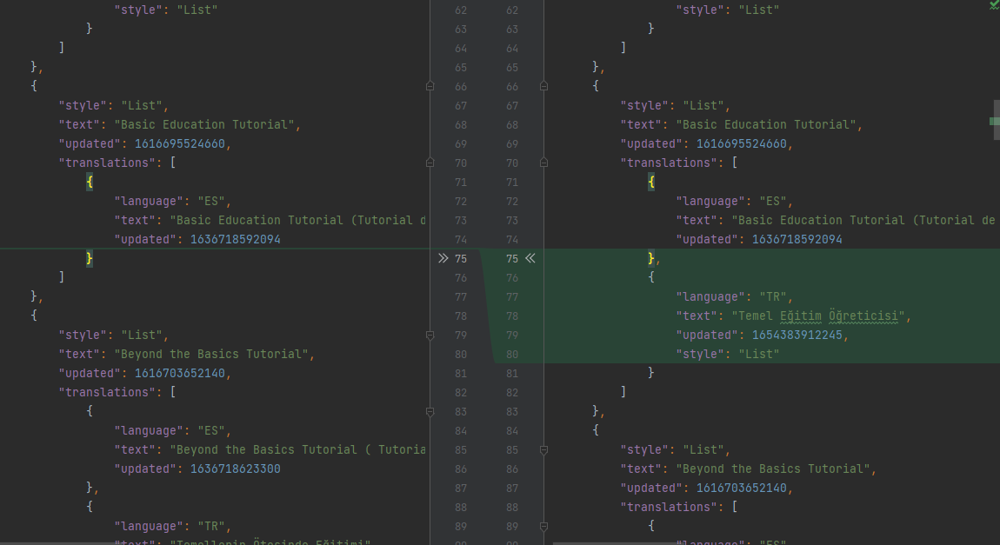

## What is it?

It automatically translates the language translation files in the Superalgos project into a language of your choice. The translation files are located in the following folders.

* Docs-Tutorials
* Docs-Nodes
* Docs-Reviews
* Docs-Concepts
* Docs-Space-Settings
* Docs-Space-Style
* Docs-Topics
* Docs-Basics
* Docs-Commands
* Docs-Commands-Errors
* Docs-Commands-Messages
* Docs-Context-Menu-Actions
* Docs-Languages
* Docs-Paragraph-Styles

### How is the translation done?
https://deepl.com is used for translations. There is no API KEY requirement during the translation process. 

### Does the original file structure get corrupted during translation?
No. In the project, many checks are made to ensure that the json file structure is not corrupted.

### Requirements (for users)
* Windows 10+ (It does not work on Linux operating system yet)
* Java 11+ (You can download it from https://www.oracle.com/technetwork/java/javase/downloads/jdk11-downloads-5066655.html)
* https://java.tutorials24x7.com/blog/how-to-install-java-11-on-windows
* Chromedriver.exe (You can download it from https://chromedriver.storage.googleapis.com/102.0.5005.61/chromedriver_win32.zip. Copy chromedriver.exe in the zip file to a desired location and add the folder containing chromedriver.exe to the "PATH" Environment Variable. For help, you can visit https://www.computerhope.com/issues/ch000549.htm.)

### How to use?
* Go to the bin folder with `cd ./Translator/bin` command.
* `java -jar translator.jar` command to see the usage and list of supported languages.
* Start the translate process with `java -jar translator.jar <root folder> <language code>` command.
* Example: `java -jar translator.jar C:\Superalgos tr-TR`
* If you want, you can translate only for a specific module.
* Example: `java -jar translator.jar C:\Superalgos\Projects\Foundations tr-TR`
* Depending on the folder you give as a parameter, the process may take longer.
* During the translation process, "_translated.json" files are added where the original files are located.
  
* Perform your translation checks in the file with the suffix "_translated.json" and correct the necessary parts.
  
* After all checks are completed, run `java -jar translator.jar C:\Superalgos apply-translations` to replace the "_translated.json" files with the original files.
* Translator does not use "git" commands in any way.
* If you have no problems, you can now commit and create a Pull Request. :-) Good job!

### What happens if I stop the Translator from running?
* Probably nothing will happen. When you restart it, it will pick up where it left off.

### Restrictions
* Translator does not need the API key. If you do a lot of translations, you may get stuck in daily limits. In this case, it can continue to work from a different internet IP address (I use a VPN).
* In some cases, errors may occur during translation. For this reason, some files cannot be translated. This is not a big problem. Because if you run Translator again, it will translate the files that were skipped without translation.
